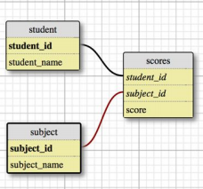

# Instructions coding test - Answers
Name: Dionysios Grigoriadis

Job Title: Bioinformatician - parasite genomics (EBI01718)

Invite to Practical assessment (Version 2)

Date: 16/12/2020

---

## A. SQL - part 1

All the provided SQL code has been tested and executed on SQLite 3.32.3 2020-06-18. Some aspects might not work with MySQL or PostgreSQL.
  
The following MySQL table is given:

```sql
CREATE TABLE person (
person_id INTEGER AUTO_INCREMENT,
father_id INTEGER,
mother_id INTEGER,
age INTEGER NOT NULL,
name VARCHAR(64) NOT NULL,
PRIMARY KEY (person_id)
);
```
---  
**Question 1**
Write a query that counts the number of people that are 21 years old.
```sql
SELECT COUNT(*)
FROM person
WHERE person.age==21;
```
  
---
**Question 2**
Write a query that counts the number of people of each age.
```sql
SELECT age,COUNT(person_id)
FROM person
GROUP BY age;
```
Outputs a table with 2 fields: 1) Age (each age in the data) 2) Count of people with the corresponding age.
  
---
**Question 3**
Write a query that extracts the siblings of a given person. We define a sibling to someone as one who
shares at least one parent.
```sql
SELECT person_id,
        -- For each key id in person, select and comma-concat the person_id(s)
        -- of the rows that share either father or mother id with the key id
        -- (exclude the row of the key id itself every time)
        (SELECT GROUP_CONCAT(temp1.person_id)
                FROM person temp1
                WHERE temp1.person_id<>perm.person_id AND (temp1.father_id==perm.father_id OR temp1.mother_id==perm.mother_id))
                AS siblings
FROM person perm;
```
Outputs a table with 2 fields: 1) Person_id 2) Comma-separated list of person_ids which are siblings of the corresponding person_id.
  
---
## B. SQL - part 2


All the provided SQL code has been tested and executed on SQLite 3.32.3 2020-06-18. Some aspects might not work with MySQL or PostgreSQL.

```sql
CREATE TABLE `student` (
`student_id` INTEGER NULL AUTO_INCREMENT DEFAULT NULL,
`student_name` VARCHAR(128) NOT NULL,
PRIMARY KEY (`student_id`)
);
-- Table 'subject'
CREATE TABLE `subject` (
`subject_id` INTEGER NULL AUTO_INCREMENT DEFAULT NULL,
`subject_name` VARCHAR(128) NOT NULL,
PRIMARY KEY (`subject_id`)
);
-- Table 'scores'
CREATE TABLE `scores` (
`student_id` INTEGER NULL DEFAULT NULL,
`subject_id` INTEGER NULL DEFAULT NULL,
`score` INTEGER NULL DEFAULT NULL,
UNIQUE KEY (`student_id`, `subject_id`)
);
-- Foreign Keys
ALTER TABLE `scores` ADD FOREIGN KEY (student_id) REFERENCES `student`
(`student_id`);
ALTER TABLE `scores` ADD FOREIGN KEY (subject_id) REFERENCES `subject`
(`subject_id`);
```

For each question 1-5, write a small query/string of code, that can return the desired output:

---
**Question 1** 
Get all students with name John.
```sql
SELECT student_id,
       student_name
       FROM student
       WHERE student_name LIKE "JOHN %";
```
  
---
**Question 2**
Get the ID and name of the student who has done best in the test with a subject_id of 2:
```sql
SELECT student_name,
       subject_name 
       FROM (SELECT student_name,
                    subject_name,
                    MAX(score) 
                    FROM scores 
                    JOIN subject ON scores.subject_id==subject.subject_id
                    JOIN student ON scores.student_id==student.student_id 
                    WHERE scores.subject_id==2);
```
   
---
**Question 3**
List the IDs and names of all students who have scored maximum (100) in English:
```sql
SELECT scores.student_id,
       student_name
       FROM scores
       JOIN subject ON scores.subject_id==subject.subject_id
       JOIN student ON scores.student_id==student.student_id
       WHERE scores.score==100 AND subject.subject_name=="English";
```

---
**Question 4**
List the names and IDs of all students who have not appeared in Maths test:
```sql
SELECT scores.student_id,
       student_name 
       FROM scores
       JOIN subject ON scores.subject_id==subject.subject_id
       JOIN student ON scores.student_id==student.student_id
       WHERE scores.score IS NULL AND subject.subject_name=="Maths";

```
  
---
**Question 5** Get a list of all students ordered by their combined score, with the student scoring the
highest at the top.
  
For this question I am assuming that combined score means average score and that when students do not appear at a test their combined score is not affected:
```sql
SELECT student_name,
       AVG(score) AS combined_score
       FROM scores
       JOIN student ON scores.student_id==student.student_id
       GROUP BY student_name
       ORDER BY combined_score DESC;
```
  
---
**Question 6** The table for students has grown in size and we have seen it takes some time to return
students when searched by student name. Is there anything that can be done to make it return the
results quicker?
  
A good first optimisation step would be to index the student.student_name field and make sure that the field is being searched with the full student name,
so the wildcharacter % doesn't have to be placed in front of the query (SQL cannot use an index to matching entries when there is a leading wildcard).
```sql
CREATE INDEX idx_name1
ON student(student_name);
```
  
A step to futher optimise the name search would be to:
1) Add a student.student_first_name and a student.student_last_name field in the student table (practically split the student_name field).
2) Also keep the already existing student.student_name.
3) Separately index all these three name columns.
4) This way, when the db is being searched by: 
    - the first name, only the student_first_name field will be queried,
    - the last name, only the student_last_name field will be queried,
    - the full name, the student_name field will be queried.
  
Because we have split the fields like that there will be no need for a trailing wildcharacter "%" so all the indices will work.
```sql
-- Table 'student'
CREATE TABLE student (
student_id INTEGER AUTO_INCREMENT DEFAULT NULL,
student_name VARCHAR(128) NOT NULL,
student_first_name VARCHAR(128) NOT NULL,
student_last_name VARCHAR(128) NOT NULL,
PRIMARY KEY (student_id)
);

-- Indexing
CREATE INDEX idx_name1
ON student(student_name);

CREATE INDEX idx_first_name
ON student(student_first_name);

CREATE INDEX idx_last_name
ON student(student_last_name);
```

## C. Code interpretation

All the provided perl code has been tested and executed on perl 5, version 16, subversion 3 (v5.16.3).

**Question 1**
Given the string AC099545.1-201, what part of the string does the following regular expressions
match?
  
**a) .***
```bash
AC099545.1-201
```
**b) .+**
```bash
AC099545.1-201
```
**c) [a-z]+**
```bash
This regular expression does not match the subject string.
```
**d)\.[0-9][0-9]?**
```bash
.1
```
**e) [12]\d{2}$**
```bash
201
```
**f) [^A-Z]+**
```bash
099545.1-201
```
**g) \D\D**
```bash
AC
```
**h) ^\w+**
```bash
AC099545
```

**How could one strip the ```-201``` from the end of the string?**
- Using bash:
```bash
acc_id="AC099545.1-201"
regex="(.+)-"

stripped_acc_id1=$(while [[ $acc_id =~ $regex ]]; do 
                       echo "${BASH_REMATCH[1]}"
                       acc_id=${acc_id#*"${BASH_REMATCH[1]}"}
                   done)

echo $stripped_acc_id1
```
- Using python:
```python
#modules load
import re

acc_id = "AC099545.1-201"

#without regex:
stripped_acc_id1 = stri.split("-")[0]

print(stripped_acc_id1)
###'AC099545.1'


#with regex:
p = re.compile('(.+)-')
stripped_acc_id2 = p.match(acc_id)[1]

print(stripped_acc_id2)
###'AC099545.1'
```
---
**Question 2**
```perl
sub hello {
my ($value) = @_;
for (my $i = 0; $i <= $value; ++$i) {
print("Hello World\n");
}
}
hello(1);
hello(4);
```
**What output will be printed on the screen if you run this code?**

Output:
```bash
Hello World
Hello World
Hello World
Hello World
Hello World
Hello World
Hello World
```

It will be 2 instances of "Hello world" for ```hello(1);``` and 5 instances of "Hello World" for ```hello(4);```

---

**Question 3**
```perl
sub count {
my ($value) = @_;
my $count = 0;
my @numbers;
for (my $i = 0; $i < 1000; ++$i) {
push(@numbers, int(rand(10)));
}
foreach my $number (@numbers) {
$count += ($value == $number ? 1 : 0);
}
return $count;
}
```

**What would be the output of count(5)?**

The output will be an integer. However this subroutine will not return a constant output every time is being executed no matter the input.
  
More specifically, this subroutine takes a number as its input, creates a list of 1000 random numbers from 0 to 9 and everytime one of these numbers match the input value the function adds 1 to a variable (which is zero initially).
  
There is 10/100 possibility that our input will match one of the randomly created numbers. In this case, there are 1000 randomly created number, so everytime the function runs we expect 100/1000 of them to match our input. Therefore, whenever we use a number from 0-9 as an input (like the count(5), the output will be an integer around the number 100.
  
Depending on how perl's rand function picks random numbers we could maybe approximate the output with a mean and a standard deviation.
 
---

**Question 4**

```perl
sub foo {
  my ($length) = @_;
  my $is_done = 0;
  my @list;

  while (!$is_done) {

    my $r = int(1 + rand($length));
    my $is_found = 0;

    foreach my $n (@list) {
      if ($n == $r) {
        $is_found = 1;
        last;
      }
    }

    if (!$is_found) {
      push(@list, $r);
    }

    $is_done = (scalar(@list) == $length);
  }

  return \@list;
}
```

**Explain the following subroutine, suggest a better way of getting the same results:**
  
This subroutine takes an integer as its input ```$length``` and returns a reference (or pointer) to an array @list of length=```$length``` that consists of a random combination of unique numbers which starts from 1 and ends to ```$length```. It is basically an unnecessarily complicated way of getting a range of numbers from 1 to ```$length``` and shuffle it.

- Better solution #1 (using the ```shuffle``` function from the **standard** ```List::Util module```):
```perl
#Load shuffle
use List::Util qw(shuffle);

### Subroutine foo ###
#Input: $length: integer.
#Output: \@list: reference to an array of length=$length that consists 
#         of a random combination of unique numbers which 
#         starts from 1 and ends to ```$length```.
sub foo {
  my ($length) = @_;
  
  @list = shuffle(1..$length);
  
  return \@list
}
```

- Better solution #2 (if, for any reason, we don't want to use any modules):
```perl
### Subroutine foo ###
#Input: $length: integer.
#Output: \@list: reference to an array of length=$length that consists 
#         of a random combination of unique numbers which 
#         starts from 1 and ends to ```$length```.
sub foo {
  my $length = 20;
  my %seen;
  my @list;

  while (scalar(keys(%seen)!=$length)) {
    my $r = int(1 + rand($length));
    if (! $seen{$r}++ ) {
      push @list, $r;
     }
  }

  return \@list

}
```
In this solution we are taking perl's hash ability to strictly have unique keys, to create the desired unique array.

---

**Question 5**
Here is a script from the Ensembl code base:
https://github.com/Ensembl/ensembl-compara/blob/release/102/scripts/homology/generate_dN_dS_stats.pl
  
**Question 5a For each of the three subroutines in the script, give a one sentence summary of what
they do?**
- ```sub calculate_average_and_other_things```: This subroutine: a) takes a DBadaptor SQL connection ```$db``` and an SQL query that selects some ```$db``` fields in string format ```$sql``` as its inputs, b) executes the ```$sql``` query on the ```$db``` database and c) returns a reference (or pointer) to a sliced array ```@stats``` that contains the per-row fetched query results (description,min,max,mean and count of ds), each fetched row per array's slice. 
- ```sub calculate_median```: This subroutine: a) takes a DBadaptor SQL connection ```$db``` and an SQL query that selects some ```$db``` fields in string format ```$sql``` as its inputs, b) executes the ```$sql``` query on the ```$db``` database, c) creates a ```ds_values``` array of all the ds values returned by the query, d) returns nothing if there are no ds values returned by the query or returns the median value of the ds values in the ```@ds_values```. The subroutine adjusts the median calculation according to whether the number of ds values in the ```@ds_values``` array is an odd or even number.
- ```sub print_stats```: This subroutine: a) takes a reference (or pointer) ```$stats``` to a sliced array. Each slice should consists of 5 values (description,min,max,mean and count of ds) like the output of the ```calculate_average_and_other_things``` subroutine, b) Iterates through the slices of the pointed array it calculates a new value named "pair lost" based on the count value of the input pointed array, format and prints the description,min,max,mean,count and newly calculated "pair lost" of each slice (each iterration).


**Question 5b If you look at this entire repo (ensembl-production), which other scripts do you think
depend on the script generate_dN_dS_stats.pl ? How did you find out?**
  
I could not find any other files in ensembl-production or ensembl-compara depending on the ```generate_dN_dS_stats.pl```.
  
I cloned both ensembl-production and ensembl-compara repositories and checked if and which of their files contain strings like the name of the script "generate_dN_dS_stats" or its subroutines "calculate_average_and_other_things","calculate_median","print_stats" in bash using grep, example: 
```bash
grep -Rn './ensembl-compara/' -e 'generate_dN_dS_stats'
```
This search only returned some scripts in the repository that use a ```print_stats``` subroutine, like the ```ensembl-compara/scripts/compare/homology_diff.pl``` However, these scripts were referring to the  ```print_stats``` subroutine of the Bio::EnsEMBL::Compara::Production::HomologySet module.

---

**Question 6**
Here is a script from the Ensembl code base:

https://github.com/Ensembl/ensembl-production/blob/release/102/scripts/copy_database.pl
  
**Question 6a Please write a couple of sentences about what you think this script does?**
  
This script's main function is to **copy the content of a database (all or specific tables)
to a target database**. It is an mediator between the user and the ```Bio::EnsEMBL::Production::Utils::CopyDatabase```
module. More specfically, it **takes some user-defined, db-related parameters as its input** (required: ```source_db_uri```, ```target_db_url``` | optional: other 
parameters that provide some extra functionality like which tables to copy/skip, what action to perform update/drop as well as logging options).
The scripts is **converting the user's input to the correct format accepted by the ```Bio::EnsEMBL::Production::Utils::CopyDatabase::copy_database``` 
function which will perform the copy**.
  
  
**Question 6b If you run this script without right flags and parameters, what happens?**
  
The script only **checks whether the user has entered values for the ```source_db_uri``` and  ```target_db_url``` parameters** and it prints out 
the script's manual if these values have not been provided. It **does not perform any other checks prior executing the database copy** as it looks 
like these are the only mandatory options required by the ```copy_database``` option. If these two values have been defined by the user, the script
will be executed even if these or the other parameters and flags do not make sense/are wrong. Then **depending on the verbosity level specified, the 
```copy_database``` will return warning/error messages** if any of these parameters are wrong.

---

## D. Pipelines
  
**Question 1**
What are the key properties of a well-designed pipeline?

- **Conceptual properties**:
    - ***Study design/Biological meaning***: The pipeline should be developed/maintained/modified so it can meet the demands of each project each given time. In the field of genomics there are so many different and unique datasets and projects. The developer should really take the study design and the biological output of the analysis into consideration to better tune and carefully select the pipeline steps.
    - ***Adjust to budget and time restrictions***: The pipelines should be adjusted to the available infrastructure and to the project deadlines (i.e. considering using more resources that means increase cost to reduce running times or vice-versa).
    - ***Careful selection of software***: The developer should take account all the previous points and stay up-to-date with the advances in the field to carefully select the best available tool for the needs of the pipeline. Sometimes similar tools have to be compared to select the best one.
  
- **Practical properties**:
    - ***Parallelisation***: Processing of maximum number of samples in parallel. Most WGS/WES projects involve at least hundreds of samples. The pipelines should be developed in the best way to facilitate efficient parallelisation.
    - ***Data integrity between pipeline steps***: Quality control steps should be implemented between steps to make sure the data integrity has not been affected for any reason. Common method: check file sizes or indexes between steps (or the actual data records but this might be time consuming).
    - ***Checks for sample mix-up***: Quality control steps should also be implemented to check whether parallelisation caused any sample mix-up between the steps. For example, in a variant calling pipeline, it should be ensured that fhe final VCF file comes from the same sample's BAM/FASTQ file.
    - ***Monitor and adjust resources required for each step:*** The pipeline should report resources usage and adjust to the given availale resources to optimise the usage of computational power.
    - ***Housekeeping! Delete intermediate temporary unwanted files:*** Genomic pipelines usually create several really big intermediate files which need to be safely deleted to optimise disk space
    - ***Module management***: Pipelines should be able to create and use environments with all necessary software and tools installed to ensure reproducibility between runs (the same versions of all software will be used).
    - ***Logging:*** The pipeline should report detailed as well as summarised, easy-to-read information/warnings/errors that will help the developer to debug/improve the pipeline.
    
- **Overcoming the challenges**: The best way to build pipelines that fulfill most of the above points is to use dedicated pipelining tools like WDL/Cromwell, nextflow, snakemake and others.

---

**Question 2**
What challenges might you meet in deploying jobs onto a compute cluster?

- ***Know the job scheduling system***: Each cluster could have different schedulers (if any) so the developer should adjust the jobs accordingly. 
- ***Different file storage systems***: File systems (FAT32,NTFS and others) which have different response times whan reading/writing. Sometimes after writing a file is good practice to include a ```sleep``` for a small amount of time.
- ***Calculate required resources and running time***: Sometimes the scheduler could give jobs low priority because the user has specified really high resources requirements and running time (or has not specified at all) but the submitted job has much lower demands. The developer should pre-estimate the resources needed by the job about to be submitted.
- ***Computer cluster might be busy***: In most of the times the computational infrastructure is being used by many staff members and users should communicate with each other and with the IT to more efficiently submit jobs. The resources availability (cpus,memory availability, I/O load) might be low and should always been checked before submitting a comple job.
- ***Software/scripts availability***: The computer cluster might not have the required software/scripts needed by the job. This can be solved by using git and virtual environments.
- ***Admin rights***: Usually the user will not have admin rights onto a computer cluster in companies or institutions. The under submission job might fail if it tries to perform an unathorised action or read/write in protected directories. This is usually a problem with hard-to-detect temporary files that many tools create in root directories.
- ***Locked environments***: Some computer clusters disable any network connection outside (i.e. Genomics England 100,000 Project research environment) which make the submission of jobs, script transfer and software installation really hard.

---

**Question 3**
How you would check the integrity of data when transferring large files between nodes/servers?
  
Hashing algorithms is an efficient way of checking data integrity when copying large files between nodes/servers. For most of data transfers I usually use the md5 hashing algorithm as its slightly faster than shs256.
  
Process (Linux systems):
- Source node/server: Create a text file including all the hashes for all the files which are about to be tranfered:
```bash
md5sum *.files | sort > ./hash_file_source.txt
```
- Copy/Move the files
- Target node/server: Create a text file including all the hashes for all the files which have been copied/moved:
```bash
md5sum *.files | sort > ./hash_file_target.txt
```
- Compare the two hash files for differences:
```bash
diff hash_file_source.txt hash_file_target.txt
```

---

**Question 4**
We have a large number of FASTQ files from resequencing and a FASTA file containing a reference
genome, and want to find variants. Propose a pipeline that could do this, and explain how you would
implement this in as an efficient matter as possible.
  
Pipeline:
  
#### Preprocessing

**Index the reference fasta file**
1. Create the FASTA sequence dictionary file: ```gatk CreateSequenceDictionary```.
2. Create the FASTA index file: ```bwa index```

#### Samples Processing

- Per sample parallelisation (some/all samples would probably have more than one FASTQ file). For each sample do:

    ***FASTQ Processing***
    - **Quality Inspection** of the raw FASTQ files: ```fastqc``` &#10140; outputs a ```raw_fastqc_report```.
    - **Quality Inspection and quality trimming** of the raw FASTQ files: ```fastp``` &#10140; outputs a ```fastp_report``` and ```trimmed_fastq_files```.
    - Input ```trimmed_fastq_files``` &#10140; **Quality Inspection** of the trimmed FASTQ files &#10140; outputs a ```trimmed_fastqc_report```.
    
    ***Alignment***
    - Input ```fasta_ref.fa``` & ```trimmed_fastq_files``` &#10140; **Align** FASTQs to the reference: ```bwa mem``` &#10140; outputs an alignment ```sam_file```.
    - Check that total number of aligned/unaligned reads match the number of total valid reads.
    - Input ```sam_file``` &#10140; **Convert** to BAM ```sambamba view``` and delete ```sam_file``` &#10140; outputs an alignment ```bam_file```.
    - Input ```bam_file``` &#10140; **Sort** the BAM file ```sambamba sort``` and then delete it &#10140; outputs a sorted alignment ```bam_file_sorted```.
    - Make sure reads in  ```bam_file_sorted``` = reads in ```bam_file``` and delete the ```bam_file```.
    - Input ```bam_file_sorted``` &#10140; **Index** ```sambamba index``` &#10140; outputs an index ```bam_file_sorted.bai```.
    
    ***Alignment processing***
    - Input ```bam_file_sorted``` &#10140;  **Tag duplicate reads** ```GATK MarkDuplicates```  &#10140; outputs a duplicates-tagged alignment ```bam_file_dedup```.
    - Input ```bam_file_dedup``` &#10140;  **Sort tagged alignment** ```GATK SortSam```  &#10140; outputs a sorted du-tagged alignment ```bam_file_dedup_sorted```. 
    - Input ```bam_file_dedup_sorted``` &#10140; **BaseQualityScoreRecalibration (BQSR)** ```GATK BaseRecalibrator/ApplyBQSR```  &#10140; outputs ```bam_file_recal```.
    - Input ```bam_file_recal``` &#10140;  **Collect Metrics** ```GATK CollectWgs/Aggregation Metrics```  &#10140; outputs ```bam_file_recal```.
    - Make sure reads in  ```bam_file_recal``` = reads in ```bam_file_sorted``` and delete all intermediate bam files.
    
    ***Variant Calling***
    - Input ```bam_file_recal``` &#10140; **Variant Calling** ```GATK HaplotypeCaller```  &#10140; outputs ```gvcf_file```.
    - Input ```bam_file_recal``` & ```gvcf_file``` &#10140; **Variant Validation** to make sure the VCF file comes from the initial bam file ```GATK ValidateVariants```.
    - Optional: Input ```gvcf_file``` &#10140; **Create a VCF file** &#10140; outputs ```vcf_file``` ready to be analysed
    
    **End of per sample parallelisation**
  
  
#### Joint Variant Calling for all samples:

Someone could just perform variant calling on each sample. Here I am assuming that we want to perform joint calling (to remove biased calls accross all samples).
    
#### Preprocessing
    1. Create reference genome intervals to iterrate over.

#### Joint Processing

- Per interval parallelisation:
    
    ***Join and genotype GVCFs***
    - Input all ```gvcf_files``` created &#10140; **Import** all gvcfs to DBI ```gatk ImportGVCFs``` &#10140; outputs ```interval_dbi```.
    - Input ```interval_dbi```  &#10140; **Genotype** accross all samples ```gatk GenotypeGVCFs```  &#10140; outputs ```interval_gvcf```.
    
     **End of interval parallelisation**

***Joint called VCF Processing***
- Input all per interval ```interval_gvcf``` &#10140; **Gather** all vcfs together ```gatk GatherVCFs``` &#10140; outputs ```gather_vcf```.
- Input ```gather_vcf``` &#10140; Indel and SNP **Recalibration** ```gatk VariantRecalibrator/ApplyVQSR``` &#10140; outputs ```recal_vcf```.
- Input ```recal_vcf``` &#10140; Calculate VariantCalling **Metrics** ```gatk CollectVariantCallingMetrics``` &#10140; outputs ```vcf_reports```.
- Use the variant calling metrics report to compare with the metrics obtained from the per sample variant calling step to **make sure each sample in the final vcf corresponds to the correct input sample**.

End of Pipeline
  
#### Pipeline Implementation

I would ideally implement this pipeline onto to a High Performance Computer cluster with a job scheduler:

- Carefully pre-compute total storage demands (maybe the given storage space is not enough) each step's resources and time demands.
- Using a pipelining tool (ideally Nextflow as its easy to direct input/output of each step) and creates meaningul log files.
- Using vritual environment with the required software installed.
- Each step will be submitted as a single job in a job chain (the server will wait required jobs to finish to submit the next one).
- Each job should carry the minimum workload possible.
- Each job should be given accurate resources and time demands.
- Become familiar with the given file system and make any adjustments if necessary.
- Perform necessary Housekeeping.

  
    
